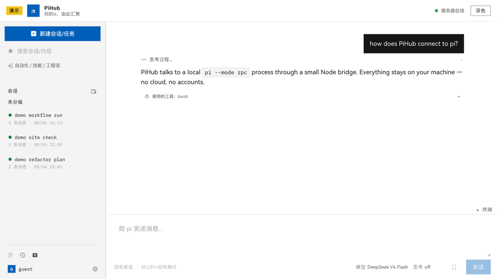
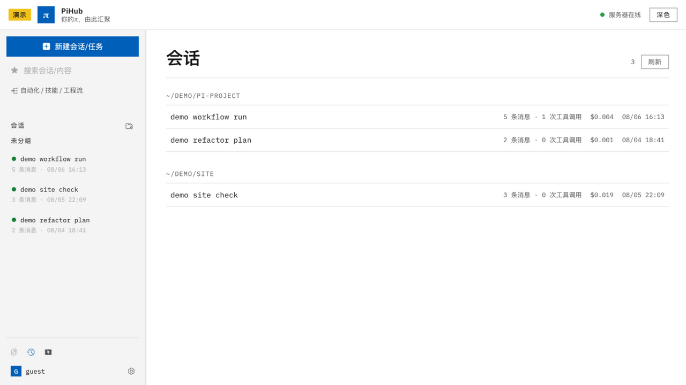
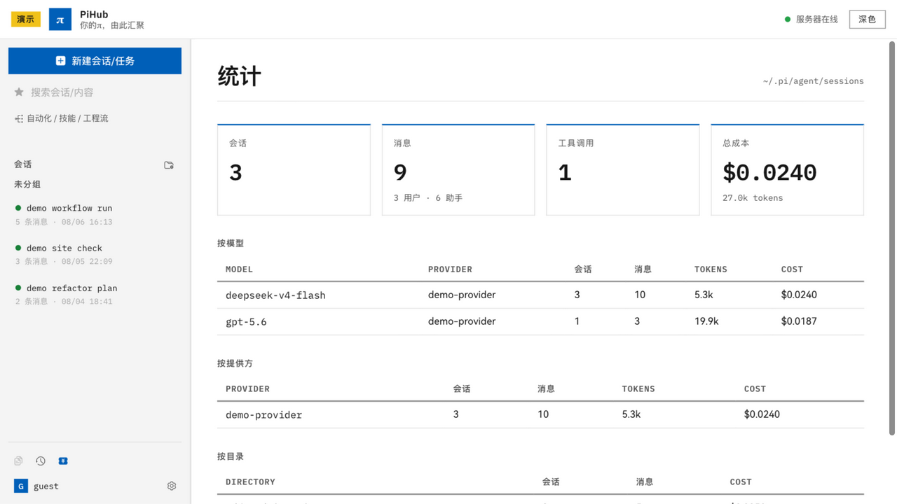
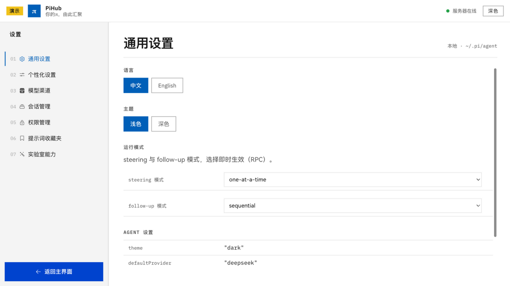
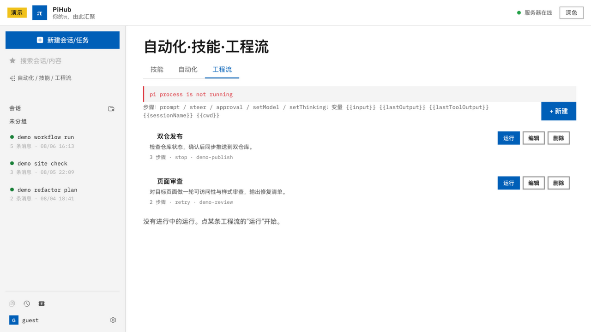

<p align="center">
  
  
  
  
</p>
<div align="center">
<span style="font-weight:600;font-size:40px">PiHub</span><br/>
<span style="font-weight:300;font-size:22px">你的π，由此汇聚</span>
<p align="center">
  <strong>pi coding agent 的本地 Web 面板。</strong><br/>
  <sub>流式对话 · 会话树 · 模型与成本 · 扩展与技能 — 全在本机浏览器里</sub>
</p>
<p align="center">
  <a href="README.md">English</a> · <strong><a href="README-CN.md">中文</a></strong> · <a href="docs/README.ru-RU.md">Русский</a>
</p>
</div>

## 代码仓库

PiHub 在以下两个同步镜像中开放开发：

- **GitHub**：<https://github.com/HapPub/PiHub>
- **AtomGit**：<https://atomgit.com/HapPub/PiHub>

欢迎在两个镜像上提交 issue 与 PR；两仓保持同步。

## PiHub 是什么

PiHub 是为 [`pi`](https://pi.dev)（`@earendil-works/pi-coding-agent`）打造的
浏览器工作台，完全运行在你的机器上。它通过一个轻量 Node 桥与本地
`pi --mode rpc` 进程通信——无需云账号。PiHub 不使用自有云服务；仅有的
外发请求发生在明确功能路径上（pi.dev 模型目录查询、以及发给你所配置的
模型提供商的请求）。

本项目为独立编写的 clean-room 实现——全部从零写出，
不复用任何外部 UI 源码。

### 本地优先设计

你的对话始终留在你的机器上。面板仅监听回环接口、绝不读取你的 agent
凭证、不运营任何自有云服务——唯一的外发请求是你显式配置的那些（模型
目录查询、发给你所选提供商的提示词）。精确边界见
[`SECURITY.md`](SECURITY.md)。

## 功能

### 对话
- 实时流式输出，支持引导（steer）/ 中断 / 跟进队列
- 推理界面：icon 化思考状态、单次运行耗时、工作流折叠（`>`）、
  可选的简化输出模式
- 内联模型与思考档位选择（选择立即生效）
- 发送方式偏好：`Enter` / `⌘+Enter` / `Ctrl+Enter`
- `/` 唤起扩展、技能与提示词模板建议
- 图片粘贴

### 文件工作台
- 会话期间触碰过的文件只读预览（工作区白名单）
- 改动文件内联 unified diff 高亮
- 最近文件条：读 / 写 / 编辑 / 补丁调用聚合，一键预览

### 会话
- 会话列表实时状态灯（已完成 / 进行中 / 已中断）
- **多标签工作台**：多个会话并行打开——点击会话即打开或切换到对应标签；
  标签独立关闭，全部关闭后回落一个全新会话标签
- **会话树**：分支时间线、节点标签、主线用户消息一键 fork
- 集合（分组 / 项目）：拖拽入组、自定义集合名
- 归档（设置页可恢复）与受保护的删除
- 右键菜单：打开 · 新建分支（克隆）· 归档 · 删除
- 详情页树过滤：全部 / 主线 / 无工具 / 仅用户
- 键盘导航：`⌘`/`Ctrl` + `↑`/`↓` 切换会话

### 模型与渠道
- 模型与思考档位切换，模型循环（`Ctrl+Shift+L`）
- 自定义 API 渠道编辑器，写入 `~/.pi/agent/models.json`
  （Base URL、Token、API 类型、最大上下文、最大输出、思考、输入类型）
- 全局与会话内 token / 成本统计

### 设置（七大区）
通用设置 · 个性化设置 · 模型渠道 · 会话管理 · 权限管理 ·
提示词收藏夹 · 实验室能力

### 自动化 · 技能 · 工程流
- 命令中心：`get_commands` 全量目录（技能 / 提示词模板 / 扩展命令），搜索与一键运行
- 自动化概览：常用开关状态（自动压缩 / 自动重试 / 模式）
- **工程流（Pipelines）**：PiHub 独家多步编排——prompt / steer / approval /
  setModel / setThinking 步骤序列在同一 pi 会话上执行，支持匹配分支、
  错误策略、人工确认闸门与实时运行时间线。隶属于内置工作流面。
- 技能导入：将任意技能转换为工程流——算法转换（零 token）或 agent 辅助转换
  （消耗 token，操作前确认）

### 多 agent 可见性
- 同机其他 agent CLI 的会话只读视图——Codex rollout 历史、AtomCode 历史、
  ZCode 模型 I/O 记录，各自独立主题色（设置页「外观」可覆盖）
- Codex 默认不被拉起；opt-in 的 `exec` 集成以 JSONL 事件流接入，
  不干扰运行中的 Codex

## 快速开始

需要 [pi](https://pi.dev)（`pi --version` ≥ 0.83）与 Node.js ≥ 20。

### 安装并运行（经 npm）

```bash
npm install -g @celading/pihub
pihub
```

然后浏览器打开 **http://127.0.0.1:3001**。`pihub` 会自行拉起
`pi --mode rpc`——之后无需再开终端。面板仅监听回环接口。

- 常驻运行：让 `pihub` 在终端标签页/后台服务中运行（如 `pihub &` 或
  launchd 配置）。
- 更换端口：`PIHUB_PORT=4000 pihub`（通用 `PORT` 环境变量同样生效）。面板仅监听回环接口。
- 发布版 bin 自带前端构建产物（按包内相对路径定位），**可从任意目录运行**
  （`npx @celading/pihub` 随处可用，无需 cd 进包目录）。

### 局域网访问（可选，默认关闭）

面板默认仅回环监听，需要时显式开启：

```bash
PIHUB_NET=lan PIHUB_ALLOWED_HOSTS=192.168.1.20 pihub   # 放行局域网 IP
```

监听所有网卡还需在 `~/.pihub/config.toml` 的 `[server]` 节写
`host = "0.0.0.0"`（TOML 解析只认节内选项，节外会被忽略）。远程 peer
默认**只读**，需先在「设置 → 访问」开启能力开关并完成配对；
完整矩阵见[使用手册](MANUAL.zh-CN.md) §12。

### 配置与数据目录

PiHub 的所有自有产物统一存放于一个专属家目录：

1. `$PIHUB_HOME`（显式指定时优先），
2. `~/.pihub`（默认），
3. `./itData`（运行目录；家目录无写权限时回退）。

家目录内的 `config.toml` 保存服务器选项（完整字段见[使用手册](MANUAL.zh-CN.md)）；
后续的数据存储、硬编码内容、数据库统一使用同一家目录。PiHub 绝不写入 `~/.pi`。
- 完整用法、功能与故障排查见 [使用手册](MANUAL.zh-CN.md)
  （[English manual](MANUAL.md)）。

### 从源码（开发）

```bash
git clone https://github.com/HapPub/PiHub.git
cd PiHub
npm install
npm run dev        # Web UI: http://localhost:18384（后端 127.0.0.1:3001）
```

生产构建：

```bash
npm run build      # typecheck + lint + 打包到 dist/
npm test           # schema 与会话解析测试
```

然后打开 **http://localhost:18384**。面板仅监听本机回环地址。

## 界面预览

展示模式截图（合成、去敏数据）：

| | |
|---|---|
|  |  |
| 聊天流：推理、工具集合折叠、实时已消耗计时、回复底部新建分支/复制 | 会话列表：集合与状态灯 |
|  |  |
| 按模型/渠道/目录的 token 与成本统计 | 七大区设置：会话恢复与删除 |
|  | |
| PiHub 独家工程流：技能导入（硬/软转换）与运行时间线 | |

## 交互演示视频

无需录屏，PiHub 可直接渲染展示（demo）模式的交互演示视频：脚本驱动真实面板
（headless Chrome），点击落在目标的绝对视口坐标并在落点呈现涟漪波浪，一次
导出 mp4 即可直接进剪辑。

前置：系统 Google Chrome（或 `CHROME_PATH`）与 PATH 中的 `ffmpeg`。

```sh
npm run showcase:record
# 产物：out/showcase-<时间戳>.mp4（h264，1280×800，30fps）
```

工作原理：

- **组件锚点** —— 关键视图带 `data-shot` 标识；录制器在每步动作后读取各锚点的
  动态状态（可见性、绝对位置与尺寸、文本）。
- **变动驱动关键帧** —— 仅当被追踪组件实际发生变化（视图切换、折叠、布局位移）
  时才截帧；无变化的停留只是延长上一关键帧的时长。运行时会打印每帧的锚点 diff，
  无需解码视频即可验证每一次 UI 变动（典型演示只录 ~12 个关键帧，替代数百张冗余截图）。
- **绝对坐标点击 + 涟漪** —— 点击落在目标组件当前 rect 解析出的精确视口坐标，
  并在落点播放涟漪波浪动画，视频观感如同真实操作。
- **仅演示数据** —— 录制永远运行合成 demo 数据集（写路由 503），不触碰真实会话与凭据。

演示步骤以声明式时间轴（`clickSel` / `type` / `press` / `wait` / `shot`）写在
`scripts/record-showcase.mjs` 中——修改步骤即可产出不同的演示。

## 快捷键

| 快捷键 | 动作 |
| --- | --- |
| `Esc` | 中断运行中的 agent |
| `Ctrl+Shift+M` | 自动化 / 技能 / 工程流面板 |
| `Ctrl+Shift+L` | 循环切换模型 |
| `⌘`/`Ctrl` + `↑`/`↓` | 切换会话 |
| `Alt+1..5` | 对话 / 会话 / 统计 / 设置 / 自动化 |

## 目录结构

```
src/       React SPA（严格 TypeScript，零 any）
server/    Node 后端 — pi RPC 桥、REST、SSE
shared/    共享类型 + zod 边界 schema
scripts/   Dev 启动器
public/    PWA manifest、图标、Service Worker
```

## 边界

- **仅本机访问**：面板只监听 `127.0.0.1` / `localhost`，并拒绝其他 Host 头。
  可选的局域网访问（`PIHUB_NET=pair` / `lan`）**默认关闭**；开启后每个
  远端需一次性配对码，且每类远程能力（prompt / steer / 删除 / shell /
  审批）各有独立开关，全部默认关闭。
- **控制令牌**：所有写接口与敏感读接口（模型配置 / 文件预览 / 会话状态 /
  SSE）都需要随进程生成的随机令牌——页面会自动获得并在请求中携带。
- **绝不读取凭据**：面板从不读取或暴露 `~/.pi/agent/auth.json`。自定义渠道
  的 API Key 只存于本地 `~/.pi/agent/models.json`，且只发送给你配置的提供商。
- **外发流量明确化**：不使用任何云服务；对 pi.dev 公共模型目录与所配置
  模型提供商的请求仅发生在明确功能路径上。
- **最小写入**：面板只写你让它写的东西——经 pi RPC 发起的新对话、
  自定义渠道（`models.json`）、以及浏览器 localStorage 中的面板偏好。
- **Clean-room**：独立实现，全部代码从零编写。

## 许可证

Apache License 2.0 — 见 [LICENSE](LICENSE)。

第三方资源：
- [HarmonyOS Sans SC](src/assets/fonts/LICENSE-HarmonyOS-Sans.txt) —
  华为终端有限公司（内嵌字体，许可证随附）
- HM Symbols 图标字体 — 来自 pub.dev `hm_symbol` 包（HarmonyOS Symbols，
  见其包许可证）
- [IBM Plex](https://github.com/IBM/plex) — SIL Open Font License

## 文档

- [Manual（中文）](MANUAL.zh-CN.md) · [Manual（English）](MANUAL.md)
- [README（English）](README.md)
- [README на русском](docs/README.ru-RU.md)
